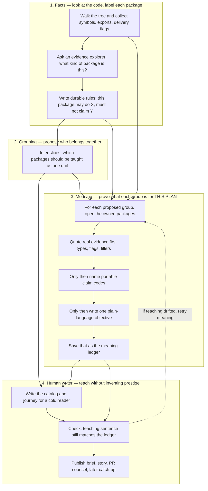

# Evidence-first refine RLM

## Architecture

### Cold read first

Imagine you open a context PR on a repo you have never touched. You need a short teaching story: which packages matter together, what each group is for, and what debt to care about. You should not have to trust a model that sounds confident.

That is what this path is for. It builds that story in four steps. The important split is: **machines settle facts and meaning first; a human-facing writer only packages the argument afterward.** If meaning is wrong, every later teaching page repeats the lie.

A real failure this design targets: roles correctly said `board` was only data shapes, adapters fill it, and it must not claim synchronization. The human-facing writer still wrote “central synchronization layer.” Cold readers believed the story. The fix is to make meaning show its homework before the writer is allowed to speak.

### Lane-by-lane cold read

**1. Facts.** Before anyone groups or teaches, we look at each package. An explorer that can read symbols decides whether it is data, HTTP surface, CLI entry, adapter, and so on. Folder names do not count. From that label we write durable rules in portable codes: what this package *is*, and what story it *must not* tell. If adapters fill a dto package, that package also records who fills it.

*Cold-reader takeaway:* “We already know what each folder actually is, in machine terms.”

**2. Grouping.** Next we infer teaching units: which packages belong in the same slice so a newcomer is not drowned in one-package-per-page noise. This step is allowed to be wrong about membership and get corrected later. It is **not** allowed to invent a glamorous purpose for the group.

*Cold-reader takeaway:* “Here is a proposed map of neighborhoods, not the speech about what each neighborhood means.”

**3. Meaning (this plan).** For each proposed group, a second explorer must open the owned packages and **quote evidence before it is allowed to speak**. Only after quotes may it emit claim codes and one plain objective. That ledger is the source of truth for “what this group is for.” Claims are copied from the ledger by code, not graded by the writer that benefits from sounding important.

*Cold-reader takeaway:* “If the objective cannot point at symbols or constraint rows, it does not ship.” Example: dto + fillers → “shared payload shapes,” never “central synchronization.”

**4. Human writer + publish.** Refine is the tutor voice. It shapes the catalog, journey, rejected alternatives, and debt so a cold reader can follow the argument. It must copy ledger objectives; it may arrange and lean, not escalate prestige. Gates fail the attempt if the teaching sentence no longer matches the ledger. Everything after that (architecture brief, root story, PR counsel, catch-up) only amplifies the grounded seed.

*Cold-reader takeaway:* “The nice prose is a packaging of settled meaning, not a second chance to redefine it.”

### Who is allowed to decide what

| Stage | Decides | Cold-read limit |
|-------|---------|-----------------|
| Role RLM | Package kind | Must not invent kind from the folder name |
| Cluster | Who sits with whom | Must not write the prestige speech |
| Slice RLM | What the group means | Must not claim without quoted evidence |
| Refine | How to teach it | Must not rewrite meaning past the ledger |
| Downstream | How widely it is repeated | Must not “improve” a grounded seed into prestige |

**Not in scope this pass:** one giant explorer that rewrites the whole catalog YAML; English verb blacklists as the main safety net; rewriting story prompts beyond inheriting grounded text; wiring unused edge kinds beyond `fills_dto`.

**Fail-closed rule a cold reader can trust:** no evidence or an overclaim → retry meaning, do not publish freehand teaching.

---

## What we're building

Stop letting `typology_refine` invent objectives and self-grade `objective_claims_yaml`. Add a **per-slice evidence-first RLM** that must quote package facts and capability constraints **before** emitting claims and an objective; persist a durable ledger; make refine CoT an **assembler** (human writer) that must copy ledger objectives.

## Why

Capability codes + claim∩must_not fail-close only when the model admits a forbidden claim. A lying sidecar still ships “central synchronization” with `claims: [data_shape]`. Role RLM already proves the portable pattern: AST context → fixed answer lines → fail-closed rewrite. Objectives need the same treatment. Downstream story and catch-up only amplify whatever refine ships, so fixing meaning at stage 3 fixes the teaching megaphone.

## Reference implementation

- **Pattern source**: role RLM in [`.majordomo/internal/contextdigest/role_rlm_validate.go`](.majordomo/internal/contextdigest/role_rlm_validate.go) (`newStropPackageRoleRLM`, `package_rlm_context.md`, parse `role:`/`evidence:`)
- **Half-step today**: [`.majordomo/internal/contextdigest/objective_grounding_rlm.go`](.majordomo/internal/contextdigest/objective_grounding_rlm.go) (audit-only, unconstrained slices)
- **Refine CoT today**: [`typologyRefineModule`](.majordomo/internal/judge/modules/signatures.go) + [`JudgeTypologyRefineGenerator.Refine`](.majordomo/internal/contextdigest/bootstrap_typology_refine.go)
- **Key difference**: RLM becomes the **writer** of objectives/claims (ledger), not a late auditor for unknowns only; CoT keeps full-catalog YAML structure (aligns with docs/advanced/10.1: no mega-RLM over the whole refine walk)

---

## Architectural analysis (glue)

### Registry / modules

- **No** new `RegisterGenerator` for the RLM (same as role / objective grounding today: `CreateRLMModule` + `RLMComplete` outside ModuleRegistry).
- **Keep** `TaskTypologyRefine` as DirectivesCoT for catalog assembly.
- **Reuse** provider task `typology_objective_grounding` (already in [`majordomo-central-config/_defaults.yaml`](majordomo-central-config/_defaults.yaml)); fallback to `typology_inspect` like today.
- Refine signature **gains input** `slice_objective_ledger_yaml` (authoritative). Prefer **Go copies claims from ledger** after parse so the model cannot re-cheat the sidecar.

### DI / call site

- Inject/replace `ObjectiveGrounder` with a `SliceObjectiveLedgerBuilder` used **before** refine Generate (inside each refine attempt after cluster proposal is stable enough to know candidate slice IDs + owned paths).
- Wire in `refineTypologyEvidence` / `TypologyRefineInput` in [`bootstrap_typology_refine.go`](.majordomo/internal/contextdigest/bootstrap_typology_refine.go).
- Context: same `evidenceDir/package_rlm_context.md` + `FormatPackageRLMContextForPath(analysisDir, …)` as role RLM; plus that slice’s constraint rows and `filled_by`.

### Config

- Provider already mapped; document the new contract in [`.majordomo/docs/advanced/10-repo-context-branch.md`](.majordomo/docs/advanced/10-repo-context-branch.md).
- Caps: reuse objective RLM style (workers + max slices); raise only if needed for full-repo digests.

### Manifest / tree

- Persist ledger as `evidence/typology/slice_objective_ledger.yaml` (evidence quotes + claims + objective per slice).
- Keep `slice_objective_claims.yaml` as the machine sidecar (derived from ledger).
- Update `ValidateTree` / manifest fields if a new required path is added (or treat ledger as required when refine complete, claims derived).

### CLI

- No new CLI; existing context-digest / bootstrap path.

---

## Data flow

1. Role RLM → `package_roles.yaml` → `package_capability_constraints.yaml` (unchanged).
2. Cluster CoT → proposal (unchanged structural role).
3. **New:** For each candidate slice (from draft + cluster-owned packages): build RLM context (owned package AST snippets + constraint rows) → query requires ordered answer:
   - `evidence:` symbol/flag quotes (not path basename)
   - `claims:` portable codes
   - `objective:` one line
   - `verdict: grounded|overclaim`
4. Parse + deterministic reject: unknown codes, claim∩must_not, empty evidence when claims imply runtime work, overclaim, missing context → fail attempt / feedback.
5. Write ledger + derive claims sidecar.
6. Refine CoT inputs include ledger; instruction: **use ledger objectives verbatim** for catalog slices; structure/bindings/journey only; do not escalate prestige.
7. Gates: `appendConstraintClaimIssues`; **new** `appendLedgerObjectiveIssues` (catalog objective text must equal ledger objective per id); ownership/hollow checks; LLM Evaluate as today.
8. Remove or demote ambiguous-only post-hoc grounder (superseded by ledger RLM for all slices with packages).

---

## Implementation phases

### Phase A — Ledger contract + parse

- Define `sliceObjectiveLedger` YAML types (id, owned_paths, evidence[], claims[], objective, verdict, source).
- Parser with known capability codes; fail-closed helpers (intersect must_not, require evidence for non-`data_shape`-only claim sets when constraints forbid sync/merge).
- Tests: board-like dto + `filled_by` cannot emit `synchronize_state`; grounded dto emits `data_shape` + evidence from types/json tags.

### Phase B — Per-slice RLM builder

- Evolve [`objective_grounding_rlm.go`](.majordomo/internal/contextdigest/objective_grounding_rlm.go) (or sibling) from auditor → ledger writer.
- Query template: cite-before-write; path basename not evidence; constraints are facts.
- Parallel workers; skip empty-ownership hollow slices (structural ownership gate remains separate).
- Stub grounder for unit tests (injectable interface).

### Phase C — Wire before refine Generate

- Build ledger each refine attempt (after cluster scrub).
- Pass `slice_objective_ledger_yaml` into refine fields.
- Rewrite [`typologyRefineModule`](.majordomo/internal/judge/modules/signatures.go) instruction: assembler + verbatim objectives; cite that claims are produced by the ledger stage.
- After successful refine parse: set claims from ledger in Go; write both YAML files; manifest paths.

### Phase D — Gates + catch-up

- Catalog objective must match ledger (normalize whitespace).
- Keep claim∩must_not as belt-and-suspenders.
- Catch-up already preserves catalog objectives into architecture; once ledger owns those strings, catch-up stays honest without new English lexicons.
- Delete ambiguous-only-only path or reduce it to “ledger missing → fail”.

### Phase E — Docs + config note

- Update `10-repo-context-branch.md`: lead with the Architecture mermaid plus the same cold-read lane explanations (not only engineer labels); evidence-first objective RLM; refine as human writer; why claims are not self-graded.
- Confirm `_defaults.yaml` still maps `typology_objective_grounding`.

### Phase F — Tests

- Unit: parse contract, must_not reject, ledger/catalog mismatch gate.
- Refine loop stub: stub RLM returns grounded ledger → refine succeeds with matching objectives; stub overclaim → retry feedback.
- Signature contract test: new input field present; claims still required on disk after refine.

---

## Plan review checklist

- Glue: RLM outside registry (like role RLM); refine generator still registered; provider key exists.
- Fail-closed: empty context / overclaim / claim∩must_not / ledger≠catalog objective.
- No English prestige verb fingerprint as the primary gate.
- Generalization: portable codes + AST snippets + edges; no gitboard nouns.
- Out of scope clearly: mega-RLM catalog, bootstrap_story rewrite, expanding unused `uses_runner`/`serves_server` edge application (follow-up unless needed for ledger context).
