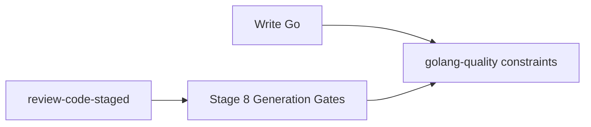

# Unify Go quality story (cursor-packs)

## What we're building

One quality narrative in **xynova/cursor-packs**: the MUSTS you follow while writing Go (`golang-quality` + `go-structured-strings`) are the same MUSTS a staged review checks, without relying on the agent to separately load generation skills during `/review-code-staged`.

## Why

Today `rules/golang.mdc` splits paths: generate → load `golang-quality`; review → load only `review-code-staged`. Staged detect stages never run CONSTRAINT 13 (templates) or most other generation gates. That is the disconnect.

## Locked design

Add a new **Detect** stage to staged review and wire the menu + docs so it is first-class.

| Piece | Change |
|-------|--------|
| New stage **8. Generation Gates** | Detect mode. MUST Read `skills/golang-quality/SKILL.md` Core constraints (1–15) and apply them as a checklist against the review target. For multi-section string builders, also apply `rules/go-structured-strings.mdc`. |
| Menu / `all` | Catalogue lists stage 8 with 1, 2, 3, 7. Run selected stages in **ascending number order**. `all` = 1→8 (consultant stages 4–6 still ask mid-pass when selected). |
| Stage 7 | Stay clarity-focused; do **not** duplicate generation gates there. Cross-ref stage 8 for templates/logging/OTEL that overlap. |
| `rules/golang.mdc` | Review path: load `review-code-staged` and state that staged review **includes** generation-gate detect (stage 8). Generation path unchanged (still load `golang-quality` while writing). |
| Skill headers | `review-code-staged`: Related → “stage 8 applies golang-quality”. `golang-quality`: Related → “reviewed by stage 8, not only while writing”. |

## Stage 8 vs Stage 3 (no double-ownership)

- **Stage 3** keeps error-handling depth (wrap-chain, `_ =`, log-without-return, persistence, named returns).
- **Stage 8** owns generation-specific gates Stage 3 does not cover: C1–3 (HTTP/cancel/txn defers), C7–15 (nil, ctx, layering, interfaces, templates, logging, OTEL), plus C4/C6 **only when Stage 3 was not selected**.

## Glue (pack ownership)

- Edit only inside the **cursor-packs** checkout (e.g. `.cursor/packs/shared` or a clone of xynova/cursor-packs), per `edit-cursor-packs`.
- Branch from `origin/main` in that repo; do not commit pack bytes into majordomo-tower.
- No new skill/rule **names** → link script allow-list unchanged.
- After pack PR lands: bump consumer submodule pins (majordomo / tower) in a separate host commit.

## Files to change (pack)

1. `skills/review-code-staged/methodology.md` — catalogue row for stage 8; full Stage 8 section with checklist; update `all` / resume text.
2. `skills/review-code-staged/SKILL.md` — Related wording; menu pointer; note that detect-only should include 8 for a full quality story.
3. `rules/golang.mdc` — unify the review bullet so stage 8 is part of the review story.
4. `skills/golang-quality/SKILL.md` — Related / When to load: also loaded by staged review stage 8.
5. Light touch `skills/review-code-staged/appendix.md` if pattern 14 / templates need a “checked in stage 8” pointer.

## Out of scope

- Renaming or deleting `golang-quality` as a write-time skill
- Consumer product code refactors
- Making stage 8 a consultant stage
- Auto-running stage 8 without user stage selection (menu still waits)

## Checkpoint

Pack PR states the unified story; “detect only” menus list stage 8 under Detect so templates and OTEL gates are not skipped by accident.

## Implementation todos

1. Add Stage 8 Generation Gates to review-code-staged methodology + SKILL
2. Align golang.mdc and golang-quality Related/When-to-load with stage 8
3. Appendix cross-ref polish; open cursor-packs PR
